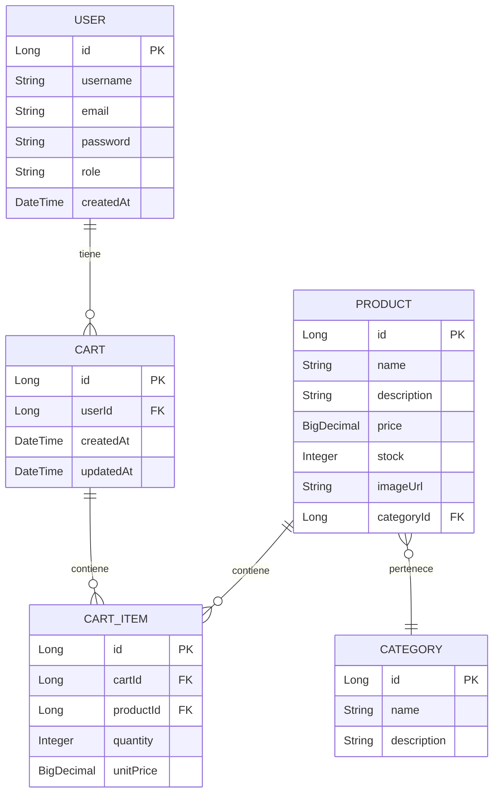

# 🛒 MiProyectoDeMuebles - E-commerce Backend

Sistema backend para una plataforma e-commerce de muebles desarrollado con **Spring Boot**. Este proyecto expone servicios RESTful que permiten gestionar usuarios, autenticación, productos, categorías, carritos de compra y banners publicitarios.

[](https://www.oracle.com/java/)
[](https://spring.io/projects/spring-boot)
[](https://maven.apache.org/)
[](https://www.mysql.com/)
[](LICENSE)

## 📋 Tabla de Contenidos

- [🏗️ Arquitectura del Proyecto](#-arquitectura-del-proyecto)
- [⚙️ Tecnologías y Dependencias](#-tecnologías-y-dependencias)
- [📁 Estructura del Proyecto](#-estructura-del-proyecto)
- [🚀 Instalación y Configuración](#-instalación-y-configuración)
- [🔐 Sistema de Autenticación](#-sistema-de-autenticación)
- [📦 Funcionalidades Principales](#-funcionalidades-principales)
- [🔍 Documentación de API](#-documentación-de-api)
- [🗄️ Base de Datos](#-base-de-datos)
- [🧪 Testing](#-testing)
- [📊 Monitoreo y Logs](#-monitoreo-y-logs)
- [🤝 Contribuir](#-contribuir)
- [👨‍💻 Autor](#-autor)
- [📄 Licencia](#-licencia)

## 🏗️ Arquitectura del Proyecto

El proyecto sigue una arquitectura de capas basada en Spring Boot:

```
┌─────────────────┐
│   Controllers   │ ← Capa de presentación (REST API)
├─────────────────┤
│    Services     │ ← Lógica de negocio
├─────────────────┤
│  Repositories   │ ← Acceso a datos (JPA)
├─────────────────┤
│     Models      │ ← Entidades de dominio
└─────────────────┘
```

## ⚙️ Tecnologías y Dependencias

| Tecnología | Versión | Propósito |
|------------|---------|-----------|
| **Java** | 17 | Lenguaje de programación |
| **Spring Boot** | 3.x | Framework principal |
| **Spring Security** | 6.x | Seguridad y autenticación |
| **Spring Data JPA** | 3.x | Persistencia de datos |
| **JWT** | - | Autenticación stateless |
| **OAuth2** | - | Autenticación con Google |
| **reCAPTCHA v2** | - | Protección anti-bot |
| **Thymeleaf** | 3.x | Motor de plantillas |
| **MySQL** | 8.0+ | Base de datos (producción) |
| **Maven** | 3.8+ | Gestión de dependencias |

## 📁 Estructura del Proyecto

```
src/main/java/edu/sena/creamuebles/
├── 🎮 controller/           # Controladores REST
│   ├── AuthController.java       # Autenticación y login
│   ├── BannerController.java     # Gestión de banners
│   ├── ProductController.java    # CRUD de productos
│   ├── CategoryController.java   # CRUD de categorías
│   ├── CartController.java       # Carrito de compras
│   ├── UserController.java       # Gestión de usuarios
│   └── view/                     # Controladores para vistas Thymeleaf
├── 📦 dto/                  # Data Transfer Objects
│   ├── BannerRequestDTO.java     # DTO para banners
│   ├── BannerResponseDTO.java    # DTO respuesta banners
│   ├── ProductRequestDTO.java    # DTO para productos
│   ├── ProductResponseDTO.java   # DTO respuesta productos
│   ├── CartItemDTO.java          # DTO para items del carrito
│   ├── CartItemRequestDTO.java   # DTO request carrito
│   ├── CartItemResponseDTO.java  # DTO response carrito
│   ├── CartResponseDTO.java      # DTO respuesta carrito
│   ├── CategoryRequestDTO.java   # DTO para categorías
│   ├── CategoryResponseDTO.java  # DTO respuesta categorías
│   ├── LoginRequestDTO.java      # DTO para login
│   ├── LoginResponseDTO.java     # DTO respuesta login
│   ├── UserRegistrationDTO.java  # DTO registro usuarios
│   ├── UserResponseDTO.java      # DTO respuesta usuarios
│   ├── UserUpdateDTO.java        # DTO actualización usuarios
│   └── RecaptchaResponse.java    # DTO para reCAPTCHA
├── 🗃️ model/                # Entidades JPA
│   ├── User.java                 # Entidad usuario
│   ├── Product.java              # Entidad producto
│   ├── Category.java             # Entidad categoría
│   ├── Cart.java                 # Entidad carrito
│   ├── CartItem.java             # Entidad item del carrito
│   └── Banner.java               # Entidad banner
├── 🔧 config/               # Configuración
│   ├── SecurityConfig.java       # Configuración de seguridad
│   ├── JwtAuthenticationFilter.java # Filtro JWT
│   ├── PasswordConfig.java       # Configuración de contraseñas
│   └── WebConfig.java            # Configuración web
├── 🗄️ repository/           # Repositorios JPA
│   ├── BannerRepository.java     # Repositorio de banners
│   ├── CartItemRepository.java   # Repositorio items carrito
│   ├── CartRepository.java       # Repositorio de carrito
│   ├── CategoryRepository.java   # Repositorio de categorías
│   ├── ProductRepository.java    # Repositorio de productos
│   └── UserRepository.java       # Repositorio de usuarios
├── 🔐 security/             # Componentes de seguridad
│   └── OAuth2AuthenticationSuccessHandler.java
├── ⚙️ service/              # Interfaces de servicios
│   ├── BannerService.java        # Servicio de banners
│   ├── CaptchaService.java       # Servicio reCAPTCHA
│   ├── CartService.java          # Servicio de carrito
│   ├── CategoryService.java      # Servicio de categorías
│   ├── JwtService.java           # Servicio JWT
│   ├── ProductService.java       # Servicio de productos
│   ├── RecaptchaService.java     # Servicio reCAPTCHA v2
│   ├── UserService.java          # Servicio de usuarios
│   └── impl/                     # Implementaciones
│       ├── BannerServiceImpl.java
│       ├── CartServiceImpl.java
│       ├── CategoryServiceImpl.java
│       ├── ProductServiceImpl.java
│       └── UserServiceImpl.java
└── 🚀 CreamueblesApplication.java # Clase principal
```

## 🚀 Instalación y Configuración

### Prerrequisitos

- Java 17 o superior
- Maven 3.8+
- MySQL 8.0+ (para producción)
- Git

### 1. Clonar el repositorio

```bash
git clone https://github.com/Rafael0896/MiProyectoDeMuebles.git
cd MiProyectoDeMuebles
```

### 2. Configurar la base de datos

#### Para desarrollo (MySQL local):
```properties
# application-dev.properties
spring.datasource.url=jdbc:mysql://localhost:3306/creamuebles_db?serverTimezone=UTC
spring.datasource.username=root
spring.datasource.password=1234
spring.datasource.driver-class-name=com.mysql.cj.jdbc.Driver
spring.jpa.hibernate.ddl-auto=create-drop
spring.jpa.show-sql=true

# OAuth2 Google
spring.security.oauth2.client.registration.google.client-id=tu_google_client_id
spring.security.oauth2.client.registration.google.client-secret=tu_google_client_secret
spring.security.oauth2.client.registration.google.scope=openid,profile,email

# reCAPTCHA v2
recaptcha.secret.key=tu_recaptcha_secret_key
```

#### Para producción (MySQL):
```properties
# application-prod.properties
spring.datasource.url=jdbc:mysql://localhost:3306/creamuebles
spring.datasource.username=tu_usuario
spring.datasource.password=tu_contraseña
spring.datasource.driver-class-name=com.mysql.cj.jdbc.Driver
spring.jpa.hibernate.ddl-auto=update
spring.jpa.database-platform=org.hibernate.dialect.MySQL8Dialect
```

### 3. Configurar variables de entorno

```bash
# Variables JWT
export JWT_SECRET=NThhODg3ZmM2YjM3YjE3MjE5YjM5M2Y2YjM5M2Y2YjM5M2Y2YjM5M2Y2YjM5M2Y2YjM5M2Y2YjM5M2Y2YjM5M2Y=

# Variables de base de datos
export DB_URL=jdbc:mysql://localhost:3306/creamuebles_db
export DB_USERNAME=root
export DB_PASSWORD=

# Variables OAuth2 Google
export GOOGLE_CLIENT_ID=tu_google_client_id
export GOOGLE_CLIENT_SECRET=tu_google_client_secret

# Variables reCAPTCHA
export RECAPTCHA_SECRET_KEY=tu_recaptcha_secret_key
```

### 4. Ejecutar el proyecto

```bash
# Desarrollo
./mvnw spring-boot:run -Dspring-boot.run.profiles=dev

# Producción
./mvnw spring-boot:run -Dspring-boot.run.profiles=prod
```

### 5. Verificar la instalación

La aplicación estará disponible en: `http://localhost:8080`

## 🔐 Sistema de Autenticación

El proyecto implementa múltiples métodos de autenticación:

### 🔑 Autenticación JWT
Autenticación tradicional mediante **JSON Web Tokens**:

#### Endpoints de autenticación:
- `POST /api/auth/register` - Registro de usuarios
- `POST /api/auth/login` - Inicio de sesión
- `POST /api/auth/refresh` - Renovar token
- `POST /api/auth/logout` - Cerrar sesión

#### Uso del token:
```bash
# Incluir en el header de las peticiones
Authorization: Bearer <tu_jwt_token>
```

### 🌐 OAuth2 con Google
Permite a los usuarios autenticarse usando su cuenta de Google:

#### Configuración:
1. Crear proyecto en [Google Cloud Console](https://console.cloud.google.com/)
2. Habilitar Google+ API
3. Configurar OAuth 2.0 credentials
4. Agregar las credenciales al `application.properties`

#### Endpoints OAuth2:
- `GET /oauth2/authorization/google` - Iniciar flujo OAuth2
- `GET /login/oauth2/code/google` - Callback de Google

### 🤖 Protección reCAPTCHA v2
Implementa Google reCAPTCHA v2 para prevenir ataques automatizados:

#### Configuración:
1. Registrar sitio en [Google reCAPTCHA](https://www.google.com/recaptcha/)
2. Obtener Site Key y Secret Key
3. Configurar en `application.properties`

### Características de seguridad:
- Tokens JWT expiran en 24 horas por defecto
- Encriptación de contraseñas con BCrypt
- Filtros personalizados para validación JWT
- Protección CSRF habilitada
- Validación reCAPTCHA en formularios críticos

## 📦 Funcionalidades Principales

### 🔑 Gestión de Usuarios
- ✅ Registro e inicio de sesión tradicional
- ✅ Autenticación OAuth2 con Google
- ✅ Perfiles de usuario
- ✅ Roles y permisos
- ✅ Recuperación de contraseña
- ✅ Protección reCAPTCHA v2

### 🪑 Gestión de Productos
- ✅ CRUD completo de productos
- ✅ Categorización de productos
- ✅ Búsqueda y filtrado
- ✅ Imágenes de productos
- ✅ Gestión de inventario

### 🛒 Carrito de Compras
- ✅ Agregar/eliminar productos
- ✅ Modificar cantidades
- ✅ Cálculo de totales
- ✅ Persistencia del carrito

### 🎯 Sistema de Banners
- ✅ Banners promocionales
- ✅ Gestión de campañas
- ✅ Programación de banners

### 📊 Dashboard Administrativo
- ✅ Estadísticas de ventas
- ✅ Gestión de inventario
- ✅ Reportes de usuarios

## 🔍 Documentación de API

### Autenticación

#### Registro de usuario
```http
POST /api/auth/register
Content-Type: application/json

{
  "username": "usuario123",
  "email": "usuario@ejemplo.com",
  "password": "contraseña123",
  "recaptchaToken": "token_recaptcha"
}
```

#### Login tradicional
```http
POST /api/auth/login
Content-Type: application/json

{
  "username": "usuario123",
  "password": "contraseña123",
  "recaptchaToken": "token_recaptcha"
}
```

#### Login con Google OAuth2
```http
GET /oauth2/authorization/google
```

### Productos

#### Obtener todos los productos
```http
GET /api/products
```

#### Obtener producto por ID
```http
GET /api/products/{id}
```

#### Crear nuevo producto
```http
POST /api/products
Content-Type: application/json

{
  "name": "Sofá Moderno",
  "description": "Sofá de tres plazas",
  "price": 1299.99,
  "categoryId": 1,
  "stock": 10
}
```

### Carrito

#### Agregar producto al carrito
```http
POST /api/cart/add
Content-Type: application/json

{
  "productId": 1,
  "quantity": 2
}
```

#### Ver carrito actual
```http
GET /api/cart
```

## 🗄️ Base de Datos

### Diagrama de Entidades



### Scripts de inicialización

El archivo `src/main/resources/data.sql` contiene datos de prueba para desarrollo.

## 🧪 Testing

### Ejecutar todas las pruebas
```bash
./mvnw test
```

### Ejecutar pruebas específicas
```bash
./mvnw test -Dtest=ProductControllerTest
```

### Coverage de pruebas
```bash
./mvnw jacoco:report
```

## 📊 Monitoreo y Logs

### Endpoints de Actuator
- `/actuator/health` - Estado de la aplicación
- `/actuator/info` - Información del proyecto
- `/actuator/metrics` - Métricas de la aplicación

### Configuración de logs
```properties
# application.properties
logging.level.edu.sena.creamuebles=DEBUG
logging.pattern.console=%d{HH:mm:ss.SSS} [%thread] %-5level %logger{36} - %msg%n
logging.file.name=logs/creamuebles.log
```

## 🤝 Contribuir

1. Fork el proyecto
2. Crea una rama para tu feature (`git checkout -b feature/AmazingFeature`)
3. Commit tus cambios (`git commit -m 'Add some AmazingFeature'`)
4. Push a la rama (`git push origin feature/AmazingFeature`)
5. Abre un Pull Request

### Estándares de código:
- Seguir las convenciones de Java
- Documentar métodos públicos
- Escribir pruebas unitarias
- Usar nombres descriptivos para variables y métodos

## 👨‍💻 Autor

**Rafael Álvarez** - [@Rafael0896](https://github.com/Rafael0896)

- 📧 Email: rafael.alvarez@ejemplo.com
- 💼 LinkedIn: [Rafael Álvarez](https://linkedin.com/in/rafael-alvarez)
- 🌐 Portfolio: [rafaelalvarez.dev](https://rafaelalvarez.dev)

## 📄 Licencia

Este proyecto está bajo la Licencia MIT. Consulta el archivo [LICENSE](LICENSE) para más detalles.

---

### 🔗 Enlaces útiles

- [Documentación de Spring Boot](https://spring.io/projects/spring-boot)
- [Guía de Spring Security](https://spring.io/guides/gs/securing-web/)
- [JWT.io](https://jwt.io/) - Información sobre JSON Web Tokens
- [MySQL Documentation](https://dev.mysql.com/doc/)

### 📈 Roadmap

- [ ] Implementar sistema de pagos (Stripe/PayPal)
- [ ] Agregar notificaciones en tiempo real (WebSocket)
- [ ] Implementar sistema de reviews y calificaciones
- [ ] Agregar soporte para múltiples idiomas (i18n)
- [ ] Implementar caché con Redis
- [ ] Agregar documentación con Swagger/OpenAPI
- [ ] Sistema de cupones y descuentos
- [ ] Integración con servicios de envío
- [ ] Dashboard de analytics avanzado
- [ ] Sistema de wishlist/favoritos

---

⭐ ¡No olvides darle una estrella al proyecto si te resultó útil!
